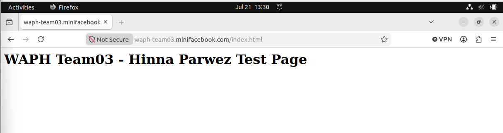

# waph-teamproject

A secure miniFacebook web application built with PHP and MySQL.

## Project Links

- Application: https://waph-team03.minifacebook.com
- Team website: `https://waph-uc-sm26-team03.github.io/`
- Video demonstration: `Add video link`
- Private repository: `https://github.com/waph-uc-sm26-team03/waph-teamproject`

---

# HTTPS Deployment

The application is deployed using HTTPS.



---

# Application Features

## Regular Users

Registered users can:

- Register using an email and password.
- Log in and log out.
- Change their password.
- Edit their profile information.
- View posts and comments.
- Create new posts.
- Edit their own posts.
- Delete their own posts.
- Comment on any post.

## Superusers

Superusers can:

- Log in using an account promoted directly in MySQL.
- View all registered users.
- Disable regular-user accounts.
- Enable regular-user accounts.

Disabled users cannot log in or continue using an existing session.

---

# Database Design

The application uses three main tables:

## Users

Stores:

- Email and hashed password
- Name
- Additional email
- Phone number
- User role
- Disabled-account status
- Account creation time

## Posts

Stores:

- Post content
- Post owner
- Creation time
- Update time

## Comments

Stores:

- Comment content
- Related post
- Comment author
- Creation time

The database relationships use foreign keys. Deleting a user or post also removes the related records using `ON DELETE CASCADE`.

---

# Security Requirements

## Password Security

Passwords are never stored as plain text.

The application uses:

- `password_hash()` when creating or changing a password
- `password_verify()` during login

## SQL Injection Protection

All queries that use application or user data are implemented with prepared statements.

## Input Validation

Input is validated at multiple levels:

- HTML attributes such as `required`, `maxlength`, and `minlength`
- PHP validation using functions such as `filter_var()` and `preg_match()`
- Prepared SQL statements and database field restrictions

## XSS Protection

Dynamic content is escaped before being displayed using the shared `e()` function and `htmlspecialchars()`.

This prevents submitted HTML and JavaScript from executing in the browser.

## CSRF Protection

Forms that change application data include a random CSRF token.

The server verifies the token before processing actions such as:

- Creating posts
- Editing posts
- Deleting posts
- Adding comments
- Editing profiles
- Changing passwords
- Enabling or disabling users
- Logging out

## Session Security

The application:

- Regenerates the session ID after login
- Uses HttpOnly session cookies
- Uses Secure cookies when HTTPS is active
- Uses `SameSite=Strict`
- Ends sessions after 30 minutes of inactivity
- Compares browser information to help detect session hijacking

## Role-Based Access Control

The application separates regular users and superusers.

- Regular users cannot access the superuser page.
- Superuser accounts cannot be created through registration.
- Superusers are promoted directly in MySQL.
- Only superusers can enable or disable accounts.

## Post Ownership

The edit and delete SQL queries include both the post ID and logged-in user ID.

This prevents users from editing or deleting posts belonging to someone else.

## Database Account

The PHP application uses the dedicated `waphuser` MySQL account instead of the MySQL root account.

## Front-End Template

The application integrates the open-source Bootstrap 5.3.3 CSS framework with additional styling in `style.css`.

---

# Database Installation

## Fresh Installation

Run `database.sql` to create a new database.

## Upgrade from Sprint 1

Run `migration_sprint2.sql` once to update the existing Sprint 1 database.

The migration adds:

- User roles
- Disabled-account status
- Post update timestamps
- The comments table

## Creating a Superuser

First, register the account normally so its password is securely hashed.

Then run:

```sql
UPDATE users
SET role = 'superuser'
WHERE email = 'admin@example.com';
```

---

# Appendix: Source Code

## PHP Source Files - WAPH Summer 2026 Team 03
### delete_post.php
```php
<?php

// Load security functions and require login.
require_once "common.php";
require_login();

// Only accept form submissions using POST.
if ($_SERVER["REQUEST_METHOD"] !== "POST") {
    http_response_code(405);
    exit("Method not allowed.");
}

// Protect the form against CSRF attacks.
verify_csrf();

// Read and validate the post ID.
$post_id = filter_input(
    INPUT_POST,
    "post_id",
    FILTER_VALIDATE_INT
);

$user_id = $_SESSION["user_id"];

if (!$post_id) {
    http_response_code(400);
    exit("Invalid post.");
}

$stmt = $conn->prepare(
    "DELETE FROM posts
     WHERE id = ?
     AND user_id = ?"
);

$stmt->bind_param(
    "ii",
    $post_id,
    $user_id
);

$stmt->execute();

$deleted_rows = $stmt->affected_rows;

$stmt->close();

// No deleted row means the user did not own the post.
if ($deleted_rows !== 1) {
    http_response_code(403);
    exit("You cannot delete this post.");
}

/*
The post's comments are also deleted because
the database uses ON DELETE CASCADE.
*/
header("Location: posts.php?status=post-deleted");
exit;

```
## /common.php
```php
<?php

// Shared session, database, and security functions.

if (session_status() !== PHP_SESSION_ACTIVE) {

    // Configure secure session-cookie settings.
    session_set_cookie_params([
        "httponly" => true,

        "secure" =>
            !empty($_SERVER["HTTPS"])
            && $_SERVER["HTTPS"] !== "off",

        "samesite" => "Strict"
    ]);

    session_start();
}

// Load the database connection.
require_once "config.php";


// Escape output to prevent XSS.
function e($value)
{
    return htmlspecialchars(
        (string) $value,
        ENT_QUOTES,
        "UTF-8"
    );
}


// Create and store a CSRF token.
function csrf_token()
{
    if (empty($_SESSION["csrf_token"])) {
        $_SESSION["csrf_token"] =
            bin2hex(random_bytes(32));
    }

    return $_SESSION["csrf_token"];
}


// Create a hidden CSRF form field.
function csrf_input()
{
    return
        '<input type="hidden" name="csrf_token" value="'
        . e(csrf_token())
        . '">';
}


// Verify the submitted CSRF token.
function verify_csrf()
{
    $submitted_token =
        $_POST["csrf_token"] ?? "";

    if (
        !is_string($submitted_token) ||
        !hash_equals(
            csrf_token(),
            $submitted_token
        )
    ) {
        http_response_code(403);
        exit("Invalid CSRF token.");
    }
}


// Clear the current session.
function end_user_session()
{
    $_SESSION = [];
    session_destroy();
}


// Require a valid logged-in user.
function require_login()
{
    global $conn;

    if (empty($_SESSION["user_id"])) {
        header("Location: login.php");
        exit;
    }

    $current_time = time();

    // End the session after 30 minutes of inactivity.
    if (
        !empty($_SESSION["last_activity"]) &&
        $current_time -
        (int) $_SESSION["last_activity"] > 1800
    ) {
        end_user_session();

        header("Location: login.php?expired=1");
        exit;
    }

    // Check whether the browser information changed.
    $current_agent = hash(
        "sha256",
        $_SERVER["HTTP_USER_AGENT"] ?? "unknown"
    );

    if (
        empty($_SESSION["user_agent"]) ||
        !hash_equals(
            $_SESSION["user_agent"],
            $current_agent
        )
    ) {
        end_user_session();

        header("Location: login.php?expired=1");
        exit;
    }

    // Record the user's latest activity time.
    $_SESSION["last_activity"] = $current_time;

    $user_id = $_SESSION["user_id"];

    // Check the current role and account status.
    $stmt = $conn->prepare(
        "SELECT role, is_disabled
         FROM users
         WHERE id = ?"
    );

    $stmt->bind_param("i", $user_id);
    $stmt->execute();

    $user = $stmt->get_result()->fetch_assoc();

    $stmt->close();

    // End access if the account is missing or disabled.
    if (
        !$user ||
        (int) $user["is_disabled"] === 1
    ) {
        end_user_session();

        header("Location: login.php?disabled=1");
        exit;
    }

    // Keep the session role synchronized with the database.
    $_SESSION["role"] = $user["role"];
}


// Require the user to be a superuser.
function require_superuser()
{
    require_login();

    if (
        ($_SESSION["role"] ?? "user")
        !== "superuser"
    ) {
        http_response_code(403);
        exit("Access denied.");
    }
}

```
## /add_comment.php
```php
<?php

// Load security functions and require login.
require_once "common.php";
require_login();

// Only accept form submissions using POST.
if ($_SERVER["REQUEST_METHOD"] !== "POST") {
    http_response_code(405);
    exit("Method not allowed.");
}

// Protect the form against CSRF attacks.
verify_csrf();

// Read and validate the submitted values.
$post_id = filter_input(
    INPUT_POST,
    "post_id",
    FILTER_VALIDATE_INT
);

$content = trim($_POST["content"] ?? "");
$user_id = $_SESSION["user_id"];

if (
    !$post_id ||
    $content === "" ||
    strlen($content) > 1000
) {
    http_response_code(400);
    exit("The comment information is not valid.");
}

// Confirm that the selected post exists.
$check = $conn->prepare(
    "SELECT id
     FROM posts
     WHERE id = ?"
);

$check->bind_param("i", $post_id);
$check->execute();

$post = $check->get_result()->fetch_assoc();

$check->close();

if (!$post) {
    header("Location: posts.php?status=invalid-post");
    exit;
}

// Add the comment using a prepared statement.
$stmt = $conn->prepare(
    "INSERT INTO comments (
        post_id,
        user_id,
        content
     )
     VALUES (?, ?, ?)"
);

$stmt->bind_param(
    "iis",
    $post_id,
    $user_id,
    $content
);

if (!$stmt->execute()) {
    $stmt->close();

    http_response_code(500);
    exit("The comment could not be added.");
}

$stmt->close();

// Return to the feed with a success message.
header("Location: posts.php?status=comment-added");
exit;

```
## /admin_user_action.php
```php
<?php

// Load security functions and require a superuser.
require_once "common.php";
require_superuser();

// Only accept form submissions using POST.
if ($_SERVER["REQUEST_METHOD"] !== "POST") {
    http_response_code(405);
    exit("Method not allowed.");
}

// Protect the action against CSRF attacks.
verify_csrf();

// Read and validate the submitted information.
$user_id = filter_input(
    INPUT_POST,
    "user_id",
    FILTER_VALIDATE_INT
);

$action = $_POST["action"] ?? "";

if (
    !$user_id ||
    !in_array(
        $action,
        ["enable", "disable"],
        true
    )
) {
    http_response_code(400);
    exit("Invalid user action.");
}


// Convert the requested action into a database value.
if ($action === "disable") {
    $is_disabled = 1;
} else {
    $is_disabled = 0;
}


/*
Update only regular-user accounts.

The role condition prevents a superuser account
from being disabled through a modified request.
*/
$stmt = $conn->prepare(
    "UPDATE users
     SET is_disabled = ?
     WHERE id = ?
     AND role = 'user'"
);

$stmt->bind_param(
    "ii",
    $is_disabled,
    $user_id
);

$stmt->execute();

$changed_rows = $stmt->affected_rows;

$stmt->close();


// Return to the user-management page.
if ($changed_rows !== 1) {
    header("Location: admin.php?status=no-change");
    exit;
}

if ($action === "disable") {
    header("Location: admin.php?status=user-disabled");
} else {
    header("Location: admin.php?status=user-enabled");
}

exit;

```
## /add_post.php
```php
<?php

// Load security functions and require login.
require_once "common.php";
require_login();

// Only accept form submissions using POST.
if ($_SERVER["REQUEST_METHOD"] !== "POST") {
    http_response_code(405);
    exit("Method not allowed.");
}

// Protect the form against CSRF attacks.
verify_csrf();

$content = trim($_POST["content"] ?? "");
$user_id = $_SESSION["user_id"];

// Validate the post content in PHP.
if (
    $content === "" ||
    strlen($content) > 2000
) {
    http_response_code(400);
    exit("Post must contain 1 to 2000 characters.");
}

// Insert the post using a prepared statement.
$stmt = $conn->prepare(
    "INSERT INTO posts (user_id, content)
     VALUES (?, ?)"
);

$stmt->bind_param(
    "is",
    $user_id,
    $content
);

if (!$stmt->execute()) {
    $stmt->close();

    http_response_code(500);
    exit("The post could not be created.");
}

$stmt->close();

// Return to the feed with a success message.
header("Location: posts.php?status=post-created");
exit;

```
## /changepassword.php
```php
<?php

// Load security functions and require login.
require_once "common.php";
require_login();

$message = "";
$user_id = $_SESSION["user_id"];

// Process the password-change form.
if ($_SERVER["REQUEST_METHOD"] === "POST") {

    // Protect the form against CSRF attacks.
    verify_csrf();

    $current_password =
        $_POST["current_password"] ?? "";

    $new_password =
        $_POST["new_password"] ?? "";

    $confirm_password =
        $_POST["confirm_password"] ?? "";

    // Get the user's current password hash.
    $stmt = $conn->prepare(
        "SELECT password FROM users WHERE id = ?"
    );

    $stmt->bind_param("i", $user_id);
    $stmt->execute();

    $result = $stmt->get_result();
    $user = $result->fetch_assoc();

    $stmt->close();

    // Validate the current and new passwords.
    if (
        !$user ||
        !password_verify(
            $current_password,
            $user["password"]
        )
    ) {
        $message = "Current password is incorrect.";

    } elseif (strlen($new_password) < 8) {
        $message =
            "New password must be at least 8 characters.";

    } elseif ($new_password !== $confirm_password) {
        $message = "New passwords do not match.";

    } else {

        // Hash the new password before saving it.
        $hashed_password = password_hash(
            $new_password,
            PASSWORD_DEFAULT
        );

        $stmt = $conn->prepare(
            "UPDATE users
             SET password = ?
             WHERE id = ?"
        );

        $stmt->bind_param(
            "si",
            $hashed_password,
            $user_id
        );

        if ($stmt->execute()) {
            $message = "Password updated successfully.";

            // Create a new session ID after the password change.
            session_regenerate_id(true);
        } else {
            $message = "Password update failed.";
        }

        $stmt->close();
    }
}
?>

<!DOCTYPE html>
<html lang="en">

<head>
    <meta charset="UTF-8">

    <meta
        name="viewport"
        content="width=device-width, initial-scale=1.0"
    >

    <title>Change Password | miniFacebook</title>

    <!-- Open-source Bootstrap framework -->
    <link
        rel="stylesheet"
        href="https://cdn.jsdelivr.net/npm/bootstrap@5.3.3/dist/css/bootstrap.min.css"
    >

    <link rel="stylesheet" href="style.css">
</head>

<body>

    <main class="container">

        <h1>Change Password</h1>

        <p>
            <a href="index.php">Back to Home</a>
        </p>

        <?php if ($message !== ""): ?>
            <p class="message">
                <?= e($message) ?>
            </p>
        <?php endif; ?>

        <form method="post" action="changepassword.php">

            <!-- Hidden CSRF token -->
            <?= csrf_input() ?>

            <label for="current_password">
                Current Password
            </label>

            <input
                type="password"
                id="current_password"
                name="current_password"
                required
            >

            <label for="new_password">
                New Password
            </label>

            <input
                type="password"
                id="new_password"
                name="new_password"
                required
                minlength="8"
            >

            <label for="confirm_password">
                Confirm New Password
            </label>

            <input
                type="password"
                id="confirm_password"
                name="confirm_password"
                required
                minlength="8"
            >

            <button type="submit">
                Update Password
            </button>

        </form>

    </main>

</body>

</html>

```
## /registration.php
```php
<?php

// Load the database connection and security functions.
require_once "common.php";

$message = "";

// Process the registration form.
if ($_SERVER["REQUEST_METHOD"] === "POST") {

    // Protect the form against CSRF attacks.
    verify_csrf();

    $name = trim($_POST["name"] ?? "");
    $email = trim($_POST["email"] ?? "");
    $password = $_POST["password"] ?? "";

    // Validate submitted information.
    if ($name === "") {
        $message = "Please enter your name.";

    } elseif (strlen($name) > 100) {
        $message = "Name must be 100 characters or fewer.";

    } elseif (
        !filter_var($email, FILTER_VALIDATE_EMAIL) ||
        strlen($email) > 100
    ) {
        $message = "Please enter a valid email address.";

    } elseif (strlen($password) < 8) {
        $message = "Password must be at least 8 characters long.";

    } else {

        // Check whether the email is already registered.
        $check = $conn->prepare(
            "SELECT id FROM users WHERE email = ?"
        );

        $check->bind_param("s", $email);
        $check->execute();
        $check->store_result();

        if ($check->num_rows > 0) {
            $message = "An account with that email already exists.";

        } else {

            // Hash the password before storing it.
            $hashed_password = password_hash(
                $password,
                PASSWORD_DEFAULT
            );

            // Create the new regular-user account.
            $stmt = $conn->prepare(
                "INSERT INTO users (email, password, name)
                 VALUES (?, ?, ?)"
            );

            $stmt->bind_param(
                "sss",
                $email,
                $hashed_password,
                $name
            );

            if ($stmt->execute()) {
                header("Location: login.php?registered=1");
                exit;
            } else {
                $message = "Registration failed. Please try again.";
            }

            $stmt->close();
        }

        $check->close();
    }
}
?>

<!DOCTYPE html>
<html lang="en">

<head>
    <meta charset="UTF-8">

    <meta
        name="viewport"
        content="width=device-width, initial-scale=1.0"
    >

    <title>Register | miniFacebook</title>

    <!-- Open-source Bootstrap framework -->
    <link
        rel="stylesheet"
        href="https://cdn.jsdelivr.net/npm/bootstrap@5.3.3/dist/css/bootstrap.min.css"
    >

    <link rel="stylesheet" href="style.css">
</head>

<body>

    <main class="container">

        <h1>Create an Account</h1>

        <?php if ($message !== ""): ?>
            <p class="message">
                <?= e($message) ?>
            </p>
        <?php endif; ?>

        <form method="post" action="registration.php">

            <!-- Hidden CSRF token -->
            <?= csrf_input() ?>

            <label for="name">Name</label>

            <input
                type="text"
                id="name"
                name="name"
                required
                maxlength="100"
                value="<?= e($_POST["name"] ?? "") ?>"
            >

            <label for="email">Email</label>

            <input
                type="email"
                id="email"
                name="email"
                required
                maxlength="100"
                value="<?= e($_POST["email"] ?? "") ?>"
            >

            <label for="password">Password</label>

            <input
                type="password"
                id="password"
                name="password"
                required
                minlength="8"
            >

            <button type="submit">
                Register
            </button>

        </form>

        <p>
            Already have an account?
            <a href="login.php">Log in</a>
        </p>

    </main>

</body>

</html>

```
## /editprofile.php
```php
<?php

// Load security functions and require login.
require_once "common.php";
require_login();

$message = "";
$user_id = $_SESSION["user_id"];

// Process the profile form.
if ($_SERVER["REQUEST_METHOD"] === "POST") {

    // Protect the form against CSRF attacks.
    verify_csrf();

    $name = trim($_POST["name"] ?? "");
    $additional_email =
        trim($_POST["additional_email"] ?? "");
    $phone = trim($_POST["phone"] ?? "");

    // Validate the profile information.
    if ($name === "") {
        $message = "Name cannot be empty.";

    } elseif (strlen($name) > 100) {
        $message = "Name must be 100 characters or fewer.";

    } elseif (
        $additional_email !== "" &&
        !filter_var(
            $additional_email,
            FILTER_VALIDATE_EMAIL
        )
    ) {
        $message = "Additional email is not valid.";

    } elseif (strlen($additional_email) > 100) {
        $message =
            "Additional email must be 100 characters or fewer.";

    } elseif (
        $phone !== "" &&
        !preg_match('/^[0-9+(). -]{7,20}$/', $phone)
    ) {
        $message = "Phone number is not valid.";

    } else {

        // Update only the logged-in user's profile.
        $sql = "
            UPDATE users
            SET
                name = ?,
                additional_email = ?,
                phone = ?
            WHERE id = ?
        ";

        $stmt = $conn->prepare($sql);

        $stmt->bind_param(
            "sssi",
            $name,
            $additional_email,
            $phone,
            $user_id
        );

        if ($stmt->execute()) {
            $_SESSION["name"] = $name;
            $message = "Profile updated.";
        } else {
            $message = "Profile update failed.";
        }

        $stmt->close();
    }
}


// Get the user's current profile information.
$sql = "
    SELECT
        name,
        email,
        additional_email,
        phone
    FROM users
    WHERE id = ?
";

$stmt = $conn->prepare($sql);
$stmt->bind_param("i", $user_id);
$stmt->execute();

$result = $stmt->get_result();
$user = $result->fetch_assoc();

$stmt->close();

// Stop if the account cannot be found.
if (!$user) {
    http_response_code(404);
    exit("User account not found.");
}
?>

<!DOCTYPE html>
<html lang="en">

<head>
    <meta charset="UTF-8">

    <meta
        name="viewport"
        content="width=device-width, initial-scale=1.0"
    >

    <title>Edit Profile | miniFacebook</title>

    <link
        rel="stylesheet"
        href="https://cdn.jsdelivr.net/npm/bootstrap@5.3.3/dist/css/bootstrap.min.css"
    >

    <link rel="stylesheet" href="style.css">
</head>

<body>

    <main class="container">

        <h1>Edit Profile</h1>

        <p>
            <a href="index.php">Back to Home</a>
        </p>

        <?php if ($message !== ""): ?>
            <p class="message">
                <?= e($message) ?>
            </p>
        <?php endif; ?>

        <form method="post" action="editprofile.php">

            <?= csrf_input() ?>

            <label for="primary_email">
                Primary Email
            </label>

            <input
                type="email"
                id="primary_email"
                value="<?= e($user["email"]) ?>"
                disabled
            >

            <label for="name">Name</label>

            <input
                type="text"
                id="name"
                name="name"
                required
                maxlength="100"
                value="<?= e($user["name"]) ?>"
            >

            <label for="additional_email">
                Additional Email
            </label>

            <input
                type="email"
                id="additional_email"
                name="additional_email"
                maxlength="100"
                value="<?= e(
                    $user["additional_email"] ?? ""
                ) ?>"
            >

            <label for="phone">Phone</label>

            <input
                type="text"
                id="phone"
                name="phone"
                maxlength="20"
                pattern="[0-9+(). -]{7,20}"
                value="<?= e($user["phone"] ?? "") ?>"
            >

            <button type="submit">
                Update Profile
            </button>

        </form>

    </main>

</body>

</html>

```
## /login.php
```php
<?php

// Load the database connection and security functions.
require_once "common.php";

$message = "";

// Display messages after registration or session problems.
if (isset($_GET["registered"])) {
    $message = "Registration successful. Please log in.";
} elseif (isset($_GET["disabled"])) {
    $message = "This account is disabled. Contact a superuser.";
} elseif (isset($_GET["expired"])) {
    $message = "Your session ended. Please log in again.";
}

// Process the login form.
if ($_SERVER["REQUEST_METHOD"] === "POST") {

    // Protect the form against CSRF attacks.
    verify_csrf();

    $email = trim($_POST["email"] ?? "");
    $password = $_POST["password"] ?? "";

    // Validate the submitted login information.
    if (!filter_var($email, FILTER_VALIDATE_EMAIL)) {
        $message = "Please enter a valid email address.";

    } elseif ($password === "") {
        $message = "Please enter your password.";

    } else {

        // Find the account using a prepared statement.
        $sql = "
            SELECT
                id,
                email,
                password,
                name,
                role,
                is_disabled
            FROM users
            WHERE email = ?
        ";

        $stmt = $conn->prepare($sql);
        $stmt->bind_param("s", $email);
        $stmt->execute();

        $result = $stmt->get_result();
        $user = $result->fetch_assoc();

        // Check that the account and password are correct.
        if (
            !$user ||
            !password_verify($password, $user["password"])
        ) {
            $message = "Incorrect email or password.";

        // Prevent disabled accounts from logging in.
        } elseif ((int) $user["is_disabled"] === 1) {
            $message = "This account is disabled. Contact a superuser.";

        } else {

            // Prevent session fixation.
            session_regenerate_id(true);

            // Store the logged-in user's information.
            $_SESSION["user_id"] = $user["id"];
            $_SESSION["email"] = $user["email"];
            $_SESSION["name"] = $user["name"];
            $_SESSION["role"] = $user["role"];

            // Store session security information.
            $_SESSION["user_agent"] = hash(
                "sha256",
                $_SERVER["HTTP_USER_AGENT"] ?? "unknown"
            );

            $_SESSION["last_activity"] = time();

            // Create a new CSRF token after login.
            unset($_SESSION["csrf_token"]);

            header("Location: index.php");
            exit;
        }

        $stmt->close();
    }
}
?>

<!DOCTYPE html>
<html lang="en">

<head>
    <meta charset="UTF-8">

    <meta
        name="viewport"
        content="width=device-width, initial-scale=1.0"
    >

    <title>Login | miniFacebook</title>

    <!-- Open-source Bootstrap framework -->
    <link
        rel="stylesheet"
        href="https://cdn.jsdelivr.net/npm/bootstrap@5.3.3/dist/css/bootstrap.min.css"
    >

    <link rel="stylesheet" href="style.css">
</head>

<body>

    <main class="container">

        <h1>Log In</h1>

        <?php if ($message !== ""): ?>
            <p class="message">
                <?= e($message) ?>
            </p>
        <?php endif; ?>

        <form method="post" action="login.php">

            <!-- Hidden CSRF token -->
            <?= csrf_input() ?>

            <label for="email">Email</label>

            <input
                type="email"
                id="email"
                name="email"
                required
                maxlength="100"
                value="<?= e($_POST["email"] ?? "") ?>"
            >

            <label for="password">Password</label>

            <input
                type="password"
                id="password"
                name="password"
                required
            >

            <button type="submit">
                Log In
            </button>

        </form>

        <p>
            Need an account?
            <a href="registration.php">Register</a>
        </p>

    </main>

</body>

</html>

```
## /index.php
```php
<?php

// Load the security functions and require a logged-in user.
require_once "common.php";
require_login();
?>

<!DOCTYPE html>
<html lang="en">

<head>
    <meta charset="UTF-8">

    <meta
        name="viewport"
        content="width=device-width, initial-scale=1.0"
    >

    <title>Home | miniFacebook</title>

    <!-- Open-source Bootstrap framework -->
    <link
        rel="stylesheet"
        href="https://cdn.jsdelivr.net/npm/bootstrap@5.3.3/dist/css/bootstrap.min.css"
    >

    <link rel="stylesheet" href="style.css">
</head>

<body>

    <main class="container">

        <h1>miniFacebook</h1>

        <!-- Safely display the logged-in user's name. -->
        <p>
            Welcome, <?= e($_SESSION["name"]) ?>!
        </p>

        <nav>
            <p>
                <a href="posts.php">
                    View and Manage Posts
                </a>
            </p>

            <p>
                <a href="editprofile.php">
                    Edit Profile
                </a>
            </p>

            <p>
                <a href="changepassword.php">
                    Change Password
                </a>
            </p>

            <!-- Only superusers can see the user-management link. -->
            <?php if (
                ($_SESSION["role"] ?? "user") === "superuser"
            ): ?>
                <p>
                    <a href="admin.php">
                        Manage Users
                    </a>
                </p>
            <?php endif; ?>
        </nav>

        <!-- Use POST and a CSRF token to log out securely. -->
        <form
            method="post"
            action="logout.php"
            class="inline-form"
        >
            <?= csrf_input() ?>

            <button type="submit" class="link-button">
                Log Out
            </button>
        </form>

    </main>

</body>

</html>

```
## /posts.php
```php
<?php

// Load security functions and require login.
require_once "common.php";
require_login();

$message = "";

// Display messages after post and comment actions.
$status = $_GET["status"] ?? "";

$status_messages = [
    "post-created" => "Post created.",
    "post-updated" => "Post updated.",
    "post-deleted" => "Post deleted.",
    "comment-added" => "Comment added.",
    "invalid-post" => "That post could not be found.",
    "not-owner" => "You cannot change that post."
];

if (isset($status_messages[$status])) {
    $message = $status_messages[$status];
}


// Get all posts and their authors.
$stmt = $conn->prepare(
    "SELECT
        posts.id,
        posts.user_id,
        posts.content,
        posts.created_at,
        users.name
     FROM posts
     JOIN users
        ON posts.user_id = users.id
     ORDER BY posts.created_at DESC"
);

$stmt->execute();
$posts = $stmt->get_result()->fetch_all(
    MYSQLI_ASSOC
);

$stmt->close();


// Get all comments and their authors.
$comment_stmt = $conn->prepare(
    "SELECT
        comments.id,
        comments.post_id,
        comments.content,
        comments.created_at,
        users.name
     FROM comments
     JOIN users
        ON comments.user_id = users.id
     ORDER BY comments.created_at ASC"
);

$comment_stmt->execute();
$comment_result = $comment_stmt->get_result();


// Group the comments by their post ID.
$comments_by_post = [];

while ($comment = $comment_result->fetch_assoc()) {
    $post_id = $comment["post_id"];
    $comments_by_post[$post_id][] = $comment;
}

$comment_stmt->close();
?>

<!DOCTYPE html>
<html lang="en">

<head>
    <meta charset="UTF-8">

    <meta
        name="viewport"
        content="width=device-width, initial-scale=1.0"
    >

    <title>Posts | miniFacebook</title>

    <!-- Open-source Bootstrap framework -->
    <link
        rel="stylesheet"
        href="https://cdn.jsdelivr.net/npm/bootstrap@5.3.3/dist/css/bootstrap.min.css"
    >

    <link rel="stylesheet" href="style.css">
</head>

<body>

    <main class="container feed-container">

        <div class="page-heading">

            <h1>miniFacebook Feed</h1>

            <a href="index.php">
                Home
            </a>

        </div>


        <?php if ($message !== ""): ?>

            <p class="message">
                <?= e($message) ?>
            </p>

        <?php endif; ?>


        <!-- Form for creating a new post. -->
        <section class="card-section">

            <h2>Create a Post</h2>

            <form method="post" action="add_post.php">

                <?= csrf_input() ?>

                <label for="content">
                    What would you like to share?
                </label>

                <textarea
                    id="content"
                    name="content"
                    required
                    maxlength="2000"
                    rows="4"
                ></textarea>

                <button type="submit">
                    Post
                </button>

            </form>

        </section>


        <?php if (count($posts) === 0): ?>

            <p>No posts yet. Create the first one.</p>

        <?php endif; ?>


        <!-- Display each post. -->
        <?php foreach ($posts as $post): ?>

            <article class="post">

                <div class="post-header">

                    <h2>
                        <?= e($post["name"]) ?>
                    </h2>

                    <small>
                        <?= e($post["created_at"]) ?>
                    </small>

                </div>


                <p>
                    <?= nl2br(e($post["content"])) ?>
                </p>


                <!-- Only the post owner sees edit and delete. -->
                <?php if (
                    (int) $post["user_id"] ===
                    (int) $_SESSION["user_id"]
                ): ?>

                    <div class="post-actions">

                        <a
                            class="button-secondary"
                            href="edit_post.php?id=<?= (int) $post["id"] ?>"
                        >
                            Edit
                        </a>


                        <form
                            method="post"
                            action="delete_post.php"
                            class="inline-form"
                            onsubmit="return confirm(
                                'Delete this post and its comments?'
                            );"
                        >

                            <?= csrf_input() ?>

                            <input
                                type="hidden"
                                name="post_id"
                                value="<?= (int) $post["id"] ?>"
                            >

                            <button
                                type="submit"
                                class="button-danger"
                            >
                                Delete
                            </button>

                        </form>

                    </div>

                <?php endif; ?>


                <!-- Display comments for this post. -->
                <section class="comments">

                    <h3>Comments</h3>

                    <?php foreach (
                        $comments_by_post[$post["id"]] ?? []
                        as $comment
                    ): ?>

                        <div class="comment">

                            <strong>
                                <?= e($comment["name"]) ?>:
                            </strong>

                            <?= nl2br(e($comment["content"])) ?>

                            <small>
                                <?= e($comment["created_at"]) ?>
                            </small>

                        </div>

                    <?php endforeach; ?>


                    <!-- Any logged-in user can add a comment. -->
                    <form
                        method="post"
                        action="add_comment.php"
                        class="comment-form"
                    >

                        <?= csrf_input() ?>

                        <input
                            type="hidden"
                            name="post_id"
                            value="<?= (int) $post["id"] ?>"
                        >

                        <label for="comment-<?= (int) $post["id"] ?>">
                            Add a comment
                        </label>

                        <textarea
                            id="comment-<?= (int) $post["id"] ?>"
                            name="content"
                            required
                            maxlength="1000"
                            rows="2"
                        ></textarea>

                        <button type="submit">
                            Comment
                        </button>

                    </form>

                </section>

            </article>

        <?php endforeach; ?>

    </main>

</body>

</html>

```
## /config.php
```php
<?php
$host = "localhost";
$dbname = "minifacebook";
$username = "waphuser";
$password = "Waph2026!";

$conn = new mysqli($host, $username, $password, $dbname);

if ($conn->connect_error) {
    die("Connection failed.");
}

$conn->set_charset("utf8mb4");
?>

```
## /admin.php
```php
<?php

// Load security functions and require a superuser.
require_once "common.php";
require_superuser();

$message = "";

// Display a message after enabling or disabling a user.
$status = $_GET["status"] ?? "";

if ($status === "user-disabled") {
    $message = "User account disabled.";
} elseif ($status === "user-enabled") {
    $message = "User account enabled.";
} elseif ($status === "no-change") {
    $message = "No user account was changed.";
}


// Get all registered users.
$stmt = $conn->prepare(
    "SELECT
        id,
        name,
        email,
        role,
        is_disabled,
        created_at
     FROM users
     ORDER BY created_at DESC"
);

$stmt->execute();

$users = $stmt->get_result()->fetch_all(
    MYSQLI_ASSOC
);

$stmt->close();
?>

<!DOCTYPE html>
<html lang="en">

<head>
    <meta charset="UTF-8">

    <meta
        name="viewport"
        content="width=device-width, initial-scale=1.0"
    >

    <title>Manage Users | miniFacebook</title>

    <!-- Open-source Bootstrap framework -->
    <link
        rel="stylesheet"
        href="https://cdn.jsdelivr.net/npm/bootstrap@5.3.3/dist/css/bootstrap.min.css"
    >

    <link rel="stylesheet" href="style.css">
</head>

<body>

    <main class="container admin-container">

        <div class="page-heading">

            <h1>Manage Users</h1>

            <a href="index.php">
                Home
            </a>

        </div>


        <?php if ($message !== ""): ?>

            <p class="message">
                <?= e($message) ?>
            </p>

        <?php endif; ?>


        <div class="table-responsive">

            <table class="user-table">

                <thead>
                    <tr>
                        <th>Name</th>
                        <th>Email</th>
                        <th>Role</th>
                        <th>Status</th>
                        <th>Action</th>
                    </tr>
                </thead>

                <tbody>

                    <?php foreach ($users as $user): ?>

                        <tr>

                            <td>
                                <?= e($user["name"]) ?>
                            </td>

                            <td>
                                <?= e($user["email"]) ?>
                            </td>

                            <td>
                                <?= e($user["role"]) ?>
                            </td>

                            <td>
                                <?php if (
                                    (int) $user["is_disabled"] === 1
                                ): ?>
                                    Disabled
                                <?php else: ?>
                                    Enabled
                                <?php endif; ?>
                            </td>

                            <td>

                                <!-- Superuser accounts cannot be disabled. -->
                                <?php if (
                                    $user["role"] === "user"
                                ): ?>

                                    <form
                                        method="post"
                                        action="admin_user_action.php"
                                        class="inline-form"
                                    >

                                        <?= csrf_input() ?>

                                        <input
                                            type="hidden"
                                            name="user_id"
                                            value="<?= (int) $user["id"] ?>"
                                        >

                                        <?php if (
                                            (int) $user["is_disabled"] === 1
                                        ): ?>

                                            <input
                                                type="hidden"
                                                name="action"
                                                value="enable"
                                            >

                                            <button
                                                type="submit"
                                                class="button-secondary"
                                            >
                                                Enable
                                            </button>

                                        <?php else: ?>

                                            <input
                                                type="hidden"
                                                name="action"
                                                value="disable"
                                            >

                                            <button
                                                type="submit"
                                                class="button-danger"
                                            >
                                                Disable
                                            </button>

                                        <?php endif; ?>

                                    </form>

                                <?php else: ?>

                                    Protected

                                <?php endif; ?>

                            </td>

                        </tr>

                    <?php endforeach; ?>

                </tbody>

            </table>

        </div>

    </main>

</body>

</html>

```
## /logout.php
```php
<?php

// Load the session and security functions.
require_once "common.php";

// Only allow logout requests submitted by the form.
if ($_SERVER["REQUEST_METHOD"] !== "POST") {
    http_response_code(405);
    exit("Method not allowed.");
}

// Verify the logout form's CSRF token.
verify_csrf();

// Remove all session data.
$_SESSION = [];

// Remove the session cookie from the browser.
if (ini_get("session.use_cookies")) {
    $cookie = session_get_cookie_params();

    setcookie(
        session_name(),
        "",
        time() - 42000,
        $cookie["path"],
        $cookie["domain"],
        $cookie["secure"],
        $cookie["httponly"]
    );
}

// End the session.
session_destroy();

// Return to the login page.
header("Location: login.php");
exit;

```
## /edit_post.php
```php
<?php

// Load security functions and require login.
require_once "common.php";
require_login();

$message = "";
$user_id = $_SESSION["user_id"];

// Get the post ID from the URL.
$post_id = filter_input(
    INPUT_GET,
    "id",
    FILTER_VALIDATE_INT
);


// Process the edit form.
if ($_SERVER["REQUEST_METHOD"] === "POST") {

    // Protect the form against CSRF attacks.
    verify_csrf();

    $post_id = filter_input(
        INPUT_POST,
        "post_id",
        FILTER_VALIDATE_INT
    );

    $content = trim($_POST["content"] ?? "");

    // Validate the edited post.
    if (
        !$post_id ||
        $content === "" ||
        strlen($content) > 2000
    ) {
        $message =
            "Post must contain 1 to 2000 characters.";

    } else {

        /*
        Update only when the post belongs to the
        logged-in user.
        */
        $stmt = $conn->prepare(
            "UPDATE posts
             SET content = ?
             WHERE id = ?
             AND user_id = ?"
        );

        $stmt->bind_param(
            "sii",
            $content,
            $post_id,
            $user_id
        );

        $stmt->execute();

        $changed_rows = $stmt->affected_rows;

        $stmt->close();

        /*
        A value of zero means the post was unchanged
        or did not belong to this user.
        */
        if ($changed_rows === 0) {

            // Check whether the user owns the post.
            $check = $conn->prepare(
                "SELECT id
                 FROM posts
                 WHERE id = ?
                 AND user_id = ?"
            );

            $check->bind_param(
                "ii",
                $post_id,
                $user_id
            );

            $check->execute();

            $owned_post =
                $check->get_result()->fetch_assoc();

            $check->close();

            if (!$owned_post) {
                http_response_code(403);
                exit("You cannot edit this post.");
            }
        }

        header(
            "Location: posts.php?status=post-updated"
        );
        exit;
    }
}


// Stop if the post ID is missing or invalid.
if (!$post_id) {
    http_response_code(400);
    exit("Invalid post.");
}


// Get the post only if it belongs to this user.
$stmt = $conn->prepare(
    "SELECT id, content
     FROM posts
     WHERE id = ?
     AND user_id = ?"
);

$stmt->bind_param(
    "ii",
    $post_id,
    $user_id
);

$stmt->execute();

$post = $stmt->get_result()->fetch_assoc();

$stmt->close();


// Prevent users from editing someone else's post.
if (!$post) {
    http_response_code(403);
    exit("You cannot edit this post.");
}
?>

<!DOCTYPE html>
<html lang="en">

<head>
    <meta charset="UTF-8">

    <meta
        name="viewport"
        content="width=device-width, initial-scale=1.0"
    >

    <title>Edit Post | miniFacebook</title>

    <!-- Open-source Bootstrap framework -->
    <link
        rel="stylesheet"
        href="https://cdn.jsdelivr.net/npm/bootstrap@5.3.3/dist/css/bootstrap.min.css"
    >

    <link rel="stylesheet" href="style.css">
</head>

<body>

    <main class="container">

        <h1>Edit Post</h1>

        <p>
            <a href="posts.php">Back to Posts</a>
        </p>

        <?php if ($message !== ""): ?>
            <p class="message">
                <?= e($message) ?>
            </p>
        <?php endif; ?>

        <form method="post" action="edit_post.php">

            <?= csrf_input() ?>

            <input
                type="hidden"
                name="post_id"
                value="<?= (int) $post["id"] ?>"
            >

            <label for="content">
                Post Content
            </label>

            <textarea
                id="content"
                name="content"
                required
                maxlength="2000"
                rows="7"
            ><?= e($post["content"]) ?></textarea>

            <button type="submit">
                Save Changes
            </button>

        </form>

    </main>

</body>

</html>

```


## CSS Source Files - WAPH Summer 2026 Team 03
### style.css
```css
body {
    margin: 0;
    background: #f6f4fb;
    color: #27233a;
    font-family: Arial, sans-serif;
}

.container {
    max-width: 620px;
    margin: 60px auto;
    padding: 30px;
    background: white;
    border-radius: 8px;
    box-shadow: 0 8px 24px rgba(45, 35, 75, 0.1);
}

.feed-container,
.admin-container {
    max-width: 850px;
}


/* Headings and links */

h1 {
    text-align: center;
}

a {
    color: #513a91;
}

.page-heading,
.post-header,
.post-actions {
    display: flex;
    align-items: center;
    justify-content: space-between;
    gap: 12px;
}

label {
    display: block;
    margin-top: 15px;
    margin-bottom: 5px;
    font-weight: 600;
}

input,
textarea {
    width: 100%;
    padding: 10px;
    box-sizing: border-box;
    border: 1px solid #b8b2c8;
    border-radius: 5px;
    font: inherit;
}

input:disabled {
    background: #eeeeee;
}

button {
    width: 100%;
    margin-top: 20px;
    padding: 12px;
    border: 0;
    border-radius: 5px;
    background: #6246a8;
    color: white;
    font-weight: 600;
    cursor: pointer;
}

button:hover,
.button-secondary:hover,
.button-danger:hover {
    opacity: 0.88;
}


/* Status messages */

.message {
    margin: 15px 0;
    padding: 10px;
    background: #eeeeee;
    border-radius: 4px;
}


/* Create-post area */

.card-section {
    margin: 20px 0;
    padding: 18px;
    border: 1px solid #d8d2e6;
    border-radius: 7px;
}

.card-section h2 {
    font-size: 1.2rem;
}


/* Posts */

.post {
    margin-top: 20px;
    padding: 15px;
    border: 1px solid #ccc;
    border-radius: 6px;
    background: white;
}

.post h2 {
    font-size: 1.2rem;
}

.post small {
    color: #666;
}


/* Comments */

.comments {
    margin-top: 18px;
    padding-top: 12px;
    border-top: 1px solid #ddd;
}

.comments h3 {
    font-size: 1rem;
}

.comment {
    margin: 8px 0;
    padding: 9px;
    background: #f2eff8;
    border-radius: 5px;
}

.comment small {
    display: block;
    color: #666;
}

.comment-form button {
    width: auto;
    padding: 8px 14px;
}


/* Inline links and action buttons */

.inline-form {
    display: inline;
}

.inline-form button,
.button-secondary,
.button-danger,
.link-button {
    display: inline-block;
    width: auto;
    margin: 0;
    padding: 8px 12px;
    border-radius: 5px;
    text-decoration: none;
}

.button-secondary {
    background: #ddd6ee;
    color: #35255c;
}

.button-danger {
    background: #a8324a;
    color: white;
}

.link-button {
    padding: 0;
    background: none;
    color: #513a91;
    text-decoration: underline;
}


/* Superuser table */

.user-table {
    width: 100%;
    border-collapse: collapse;
}

.user-table th,
.user-table td {
    padding: 10px;
    border-bottom: 1px solid #ddd;
    text-align: left;
}


/* Mobile layout */

@media (max-width: 700px) {

    .container {
        margin: 20px 12px;
        padding: 20px;
    }

    .page-heading,
    .post-header {
        align-items: flex-start;
        flex-direction: column;
    }
}

```


## SQL Source Files - WAPH Summer 2026 Team 03
### migration_sprint2.sql
```sql
USE minifacebook;

ALTER TABLE users
    ADD COLUMN role
        ENUM('user', 'superuser')
        NOT NULL
        DEFAULT 'user',

    ADD COLUMN is_disabled
        TINYINT(1)
        NOT NULL
        DEFAULT 0;

ALTER TABLE posts
    ADD COLUMN updated_at
        TIMESTAMP
        DEFAULT CURRENT_TIMESTAMP
        ON UPDATE CURRENT_TIMESTAMP;

CREATE TABLE comments (
    id INT AUTO_INCREMENT PRIMARY KEY,

    post_id INT NOT NULL,

    user_id INT NOT NULL,

    content TEXT NOT NULL,

    created_at TIMESTAMP
        DEFAULT CURRENT_TIMESTAMP,

    FOREIGN KEY (post_id)
        REFERENCES posts(id)
        ON DELETE CASCADE,

    FOREIGN KEY (user_id)
        REFERENCES users(id)
        ON DELETE CASCADE
);

```
## /database.sql
```sql
-- Create and select the miniFacebook database.

CREATE DATABASE IF NOT EXISTS minifacebook;

USE minifacebook;


-- Store regular users and superusers.

CREATE TABLE users (
    id INT AUTO_INCREMENT PRIMARY KEY,

    email VARCHAR(100)
        NOT NULL
        UNIQUE,

    password VARCHAR(255)
        NOT NULL,

    name VARCHAR(100)
        NOT NULL,

    additional_email VARCHAR(100),

    phone VARCHAR(20),

    role ENUM('user', 'superuser')
        NOT NULL
        DEFAULT 'user',

    is_disabled TINYINT(1)
        NOT NULL
        DEFAULT 0,

    created_at TIMESTAMP
        DEFAULT CURRENT_TIMESTAMP
);


-- Store posts created by users.

CREATE TABLE posts (
    id INT AUTO_INCREMENT PRIMARY KEY,

    user_id INT NOT NULL,

    content TEXT NOT NULL,

    created_at TIMESTAMP
        DEFAULT CURRENT_TIMESTAMP,

    updated_at TIMESTAMP
        DEFAULT CURRENT_TIMESTAMP
        ON UPDATE CURRENT_TIMESTAMP,

    FOREIGN KEY (user_id)
        REFERENCES users(id)
        ON DELETE CASCADE
);

CREATE TABLE comments (
    id INT AUTO_INCREMENT PRIMARY KEY,

    post_id INT NOT NULL,

    user_id INT NOT NULL,

    content TEXT NOT NULL,

    created_at TIMESTAMP
        DEFAULT CURRENT_TIMESTAMP,

    FOREIGN KEY (post_id)
        REFERENCES posts(id)
        ON DELETE CASCADE,

    FOREIGN KEY (user_id)
        REFERENCES users(id)
        ON DELETE CASCADE
);

```
